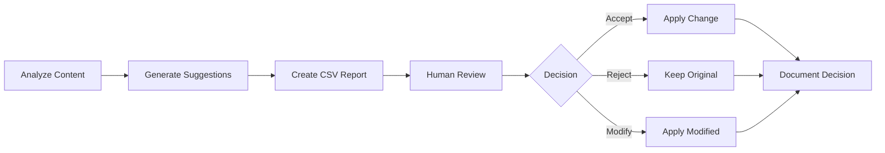

# ADR-002: Human-in-the-Loop Design

**Status**: Accepted  
**Date**: 2025-01-12  
**Decision Makers**: Development Team, Compliance, Content Team

## Context

Automated content analysis can identify issues and suggest improvements, but applying changes automatically risks:
1. Changing technical meaning
2. Introducing compliance issues
3. Losing nuanced context
4. Creating inconsistencies

### Considered Options

1. **Fully Automated**
   - Apply all suggestions automatically
   - No human review required
   - Fastest implementation

2. **Blocking Automated**
   - Auto-apply low-risk changes
   - Block on high-risk issues
   - Partial human review

3. **Human-in-the-Loop**
   - All changes reviewed by human
   - Decisions documented
   - Full editorial control

4. **Confidence-Based**
   - Apply based on confidence scores
   - Human review for uncertain cases
   - ML-driven approach

## Decision

We will implement a **Human-in-the-Loop** design where all suggestions require human review and approval.

## Rationale

### Regulatory Compliance
- Financial services require precise language
- Legal implications of wording changes
- Audit trail requirements
- Demonstrable human oversight

### Context Preservation
- Questions interconnected within journeys
- Technical accuracy paramount
- Industry-specific terminology sometimes required
- Regional variations important

### Quality Assurance
- Humans catch subtle meaning changes
- Editorial consistency maintained
- Brand voice preserved
- Cultural sensitivity checked

### Risk Management
- No automated changes to production content
- Every change traceable to human decision
- Rationale documented for audits
- Rollback possible with decision history

## Implementation

### Workflow Design

### Decision Types
- **Accept**: Use suggested improvement as-is
- **Reject**: Keep original text
- **Modified**: Human-edited version of suggestion

### Documentation Requirements
- Decision for each flagged item
- Optional notes for rationale
- Timestamp of review
- Reviewer identification

### Quality Controls
- Suggestions are advisory only
- No automatic application
- Batch review supported
- Export decisions for audit

## Consequences

### Positive
- ✅ Full editorial control maintained
- ✅ Compliance requirements met
- ✅ Audit trail complete
- ✅ Context preserved
- ✅ Quality assured
- ✅ Risk minimized

### Negative
- ❌ Slower than full automation
- ❌ Requires human resources
- ❌ Potential bottleneck
- ❌ Subjective decisions

### Mitigations
- Batch processing for efficiency
- Clear severity prioritization
- Training on guidelines
- Regular review sessions scheduled
- Escalation path defined

## Metrics

### Success Indicators
- % of suggestions accepted (target: 60-80%)
- Time to review per field (target: < 30 seconds)
- Consistency across reviewers (> 80% agreement)
- Audit pass rate (100%)

### Review Triggers
- Acceptance rate < 40% (suggestions poor)
- Acceptance rate > 95% (consider automation)
- Review time > 1 minute per field
- Inconsistent decisions across reviewers

## Future Considerations

### Phase 2 Enhancements
- Confidence scoring for suggestions
- Auto-apply for specific categories
- ML learning from decisions
- Reviewer consensus features

### Phase 3 Possibilities
- Selective automation for low-risk changes
- Real-time suggestion during authoring
- Predictive quality scoring
- Automated consistency checking

## Review Schedule

- **Monthly**: Review decision patterns
- **Quarterly**: Assess automation opportunities
- **Annually**: Evaluate architecture

## Related Decisions

- [ADR-001](./ADR-001-csv-output.md): CSV format enables human review
- PRD Section 4.3: Workflow Integration
- Tone Guidelines: Human judgment required

## References

- FCA Guidance on Algorithmic Decision Making
- ISO 9001:2015 Quality Management
- GDPR Article 22: Automated Decision Making

## Decision History

- 2025-01-12: Initial decision
- Based on Session 011 discussions
- Validated by compliance requirements