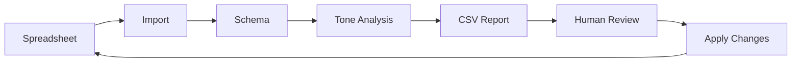

# Analysis System Documentation

## Overview

This area contains all documentation related to the RBSI journey content analysis system, including tone of voice analysis, quality metrics, and improvement workflows.

## Purpose

The analysis system helps ensure all journey content meets quality standards by:
- Analyzing question text against tone of voice guidelines
- Identifying jargon, complexity, and length issues
- Providing actionable improvement suggestions
- Maintaining human editorial control
- Creating audit trails for compliance

## Documentation Structure

### 📋 Product Documentation
- [PRD - Tone Analysis System](./PRD-tone-analysis-system.md) - Product requirements and user stories
- [Implementation Plan](./implementation-plan.md) - Phased rollout strategy

### 🏗️ Architecture Decisions
- [ADR-001: CSV Output Format](./ADR-001-csv-output.md) - Why CSV for stakeholder review
- [ADR-002: Human-in-the-Loop](./ADR-002-human-in-loop.md) - Editorial control approach

### 📊 Analysis Reports
- Located in `apps/prototype/data/generated/analysis/`
- CSV reports for each journey analyzed
- Summary reports in Markdown format

## Quick Start

### Running an Analysis

```bash
# 1. Ensure you have a schema to analyze
ls apps/prototype/data/schemas/your-journey/

# 2a. Run the field inventory (KYCP schemas)
node apps/prototype/scripts/analyze_fields.mjs non-lux-1-1

# Outputs:
# apps/prototype/data/generated/analysis/non-lux-1-1/fields.csv
# apps/prototype/data/generated/analysis/non-lux-1-1/summary.json

# 2b. Run the tone analyzer (optional)
python3 scripts/analyze_tone.py \
  --schema apps/prototype/data/schemas/your-journey/schema.yaml \
  --output analysis/your-journey-tone.csv \
  --summary

# 3. Review the CSV output
open analysis/your-journey-tone.csv
```

### Processing Results

1. **Review CSV**: Open in spreadsheet application
2. **Make Decisions**: Mark each row as Accept/Reject/Modified
3. **Add Notes**: Document rationale for decisions
4. **Apply Changes**: Update source or schema based on accepted improvements

## Key Metrics

### Current Analysis (non-lux-1-1)
- **Total Fields**: 788
- **Issues Found**: 438 (55.6%)
- **High Severity**: 51 (11.6%)
- **Processing Time**: < 1 minute

Field inventory (from summary.json):
- fields: total count
- withVisibility: fields with rules
- required: fields marked required
- complexParents/complexChildren: repeater containers and children
- lookupNoOptions: lookups missing option lists
Top controllers: top 20 controlling keys by frequency

### Issue Categories
1. **Jargon** - Banking/legal terminology
2. **Length** - Questions over 20 words
3. **Complexity** - Multi-clause sentences
4. **Pronouns** - Third vs second person
5. **Voice** - Passive vs active

## Workflow Integration



## Success Criteria

### Quality Targets
- No questions over 30 words
- < 5% passive voice usage
- Zero unexplained jargon
- 100% second-person pronouns
- Reading level ≤ 9 years

### Process Targets
- < 2 minutes analysis time
- < 1 day stakeholder review
- 100% decision documentation
- Full change traceability

## Tools & Scripts

### Primary Tools
- `scripts/analyze_tone.py` - Main analysis engine
- `scripts/import_xlsx_kycp.py` - KYCP-aligned importer
- `Documents/01 Areas/guide/Complete-Workflow-Guide.md` - Full process guide

### Supporting Documents
- `Documents/01 Areas/tone-of-voice/README.md` - Content guidelines
- `Documents/01 Areas/session-context/` - Work logs

## Future Enhancements

### Phase 1 (Current)
- ✅ Manual analysis via script
- ✅ CSV output for review
- ✅ Basic severity classification

### Phase 2 (Planned)
- Pre-import validation
- Automated suggestion application
- Metrics dashboard

### Phase 3 (Future)
- CI/CD integration
- Self-service portal
- ML-powered improvements

## Contact & Support

For questions about the analysis system:
1. Check this documentation
2. Review session contexts for implementation details
3. Consult the Complete Workflow Guide
4. Review ADRs for design rationale

---

*Last Updated: 2025-01-12*
*System Version: 1.0.0*
